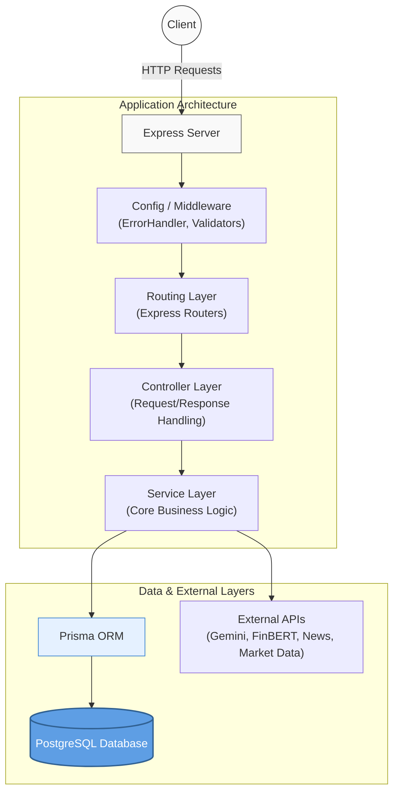

<h1 align="center">FinPilot (Financial Adviser Backend API)</h1>

<div align="center">
  
  
  
  
  
  
</div>

<br>

> **An AI-powered financial adviser backend** built with Node.js, Express, TypeScript, and Google Gemini AI. It provides real-time market analysis, portfolio recommendations, and investment guidance specifically tuned for cryptocurrencies and precious metals.

---

## ⚡ Key Features

- **📊 Portfolio Management System**
  - Track, add, update, and remove assets (Cryptocurrencies & Precious Metals).
  - Automated portfolio analysis running locally every 5 minutes.
  - Generates AI-powered **Buy / Sell / Hold** recommendations with confidence scoring and risk assessment.
  
- **📰 Real-Time News & Sentiment Aggregation**
  - Multi-source financial news fetching (NewsAPI, GNews, Currents API).
  - Natural Language Processing (NLP) sentiment analysis using **HuggingFace FinBERT**.
  - Real-time event streaming to clients via Server-Sent Events (SSE).

- **🤖 Intelligent Financial Chatbot**
  - Powered by **Google Gemini AI** with Google Search grounding.
  - Context-aware conversations with persistent session memory.
  - Transparent source citations, intelligent web data access, and strict risk disclaimers.

---

## 🏗️ Architecture & Design

This project implements a clean layered architecture, enforcing strict separation of concerns to guarantee robust maintainability and testability.

### 🔄 Data Flow



### 📂 Directory Structure

```text
src/
├── config/         # Environment variables & DB connection setup
├── controllers/    # Route controllers (req, res handling)
├── middleware/     # Express middlewares (Validation, Error Handling, Rate Limiting)
├── routes/         # Express route definitions
├── services/       # Core business logic (Cache, Chat, Cron, Market, News)
├── types/          # TypeScript interfaces & type definitions
└── utils/          # Utility functions and standard loggers
```

---

## 🛠️ Technology Stack

| Category         | Technologies Used |
|-----------------|-------------------|
| **Runtime**     | Node.js, TypeScript |
| **Framework**   | Express.js |
| **Database**    | PostgreSQL, Prisma ORM |
| **AI / ML**     | Google Gemini AI (Agent/Grounding), HuggingFace FinBERT (Sentiment) |
| **External APIs**| CoinGecko (Crypto), Gold API (Metals), NewsAPI/GNews (News) |
| **Tooling**     | Winston (Logging), Node-Cache (Caching), Express-Validator |

---

## 🚀 Getting Started

### Prerequisites

Ensure you have the following installed on your local machine:
- **Node.js** (v18 or higher)
- **PostgreSQL** running locally or via a cloud provider.

### Installation

1. **Clone the repository**
   ```bash
   git clone <repository-url>
   cd financial-advisory-backend # Or your respective directory
   ```

2. **Install dependencies**
   ```bash
   npm install
   ```

3. **Configure Environment Variables**
   Copy the example config to configure your local keys. Look inside the `.env.example` file for detailed instructions on acquiring required API keys.
   ```bash
   cp .env.example .env
   ```

4. **Initialize Database**
   Generate the Prisma Client and run migrations to build your SQL schema.
   ```bash
   npx prisma generate
   npx prisma migrate dev
   ```

5. **Start the Server**
   ```bash
   npm run dev
   ```
   *The server will start on `http://localhost:3000`*

---

## 📖 API Documentation

The REST API is structurally grouped into the following domains:

- **Health:** `/api/health` - Basic ping endpoint.
- **Portfolio:** `/api/portfolio/*` - CRUD operations, automated recommendations, and targeted asset analysis.
- **News:** `/api/news/*` - Query articles by asset type/sentiment, access summarized news, and subscribe to SSE streams.
- **Chat:** `/api/chat/*` - Interact with the AI Adviser and fetch contextual conversation histories.

*(For detailed Request/Response schemas, refer to the Postman collection or code validators).*

---

## 🗄️ Database Schema Summary

- **Portfolio (`assets`)**: Tracks individual user holdings, symbols, types, and amounts.
- **Recommendations (`recommendations`)**: AI trading indicators (BUY/SELL/HOLD), reasoning text, confidence scores, technicals, and risk levels.
- **News (`news_articles`)**: Cached articles with FinBERT-scored sentiment, relevance filtering, and source origin.
- **Chat History (`chat_messages`)**: AI agent dialogues linked to a conversation UUID to preserve context over sessions.

---

*Built for advanced automated financial insights. Disclaimer: Not actual certified financial advice.*
